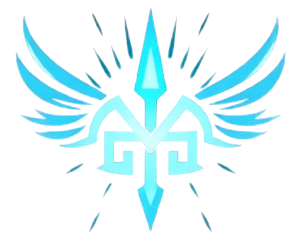

     
    

---

<!--

   
  
   

  --->
  

    <strong>Hey there! I'm Runarok</strong>, a passionate coder from Bengaluru, Karnataka, India. 🚀  
    I'm into *manga*, *anime*, *music*, and *movies*, and love experimenting with code. 🎮🎶🎬  
    Here on my GitHub, you'll find an exciting collection of my personal projects: everything from interactive games to web experiments and more. Explore, fork, or just enjoy the code! 😄

## About Me

I have a strong passion for coding and am proficient in languages such as C, C++, and Python. These days, I mainly work with HTML, CSS, and JavaScript, combining my knowledge and new resources I discover. Most of my projects are simple and built using basic HTML, but I always aim to learn and improve. Feel free to explore my code and make any modifications you'd like! 🎨💻

Coding is a continuous journey for me, and I'm always looking for new ways to improve my skills and share my knowledge. 😄✨

  
<strong>Meaning Behind My UserName</strong>
 
  
**"Runarok"** is a combination of two Norse elements:

- **Runar**: Derived from the word "rún" (meaning "rune" or "mystery" in Old Norse), often associated with ancient symbols used for divination, magic, and wisdom.
- **Rok**: A variation of the word "rök," meaning "fate" or "doom" in Old Norse, often referring to a significant, transformative event, like the end of the world (Ragnarök).

**"Runarok"** can be interpreted as:

- The **fate of runes** or the **mystery of fate**, combining ancient wisdom and the inevitability of destiny.
- A powerful, mystical force that brings about change or destruction, evoking images of an inevitable and profound event, like the cataclysmic events in Norse mythology (**Ragnarök**).

**"RunarokHrafn"** is used in some of my profiles, and it adds another element:

- **Hrafn**: Meaning "raven" in Old Norse, this bird is often associated with wisdom, knowledge, and prophecy in Norse mythology. Ravens were considered messengers, often linked to the gods, especially Odin, who had two ravens, Huginn (thought) and Muninn (memory).

Together, **"RunarokHrafn"** can be interpreted as:

- The **mystery of fate** combined with the **wisdom and prophecy of the raven**, suggesting a powerful force that knows and sees the course of destiny.
- A symbolic blend of ancient wisdom, fate, and the watchful eye of the raven, always observing the unfolding of events.
  

---

<table align="center">
  <tr>
    <td align="center">
      You can explore all my projects on my <strong><a href="https://runarok.github.io/">GitHub Page</a></strong>.
        
      
    </td>
    <td rowspan="2" align="center">
      
    </td>
  </tr>
      <td align="center">
        <strong>👋 Hello Visitor Nr</strong> 
        
      </td>
    </tr>
    <td align="center">
      
    </td>
    <td align="center">
      
    </td>
  </tr>
</table>

---

  <picture>
    <source media="(prefers-color-scheme: dark)" srcset="https://raw.githubusercontent.com/Runarok/Runarok/Snake/github-snake-dark.svg" />
    <source media="(prefers-color-scheme: light)" srcset="https://raw.githubusercontent.com/Runarok/Runarok/Snake/github-snake.svg" />
    
  </picture>

&nbsp;

  

&nbsp;

  

---

> **I often draw inspiration from various online sources to enhance my projects and am always willing to remove any content that may unintentionally resemble existing code. While I take inspiration from different works, I don't simply copy and paste; instead, I incorporate ideas in a way that reflects my own understanding and creativity.**

<!--
---
## GitHub Stats

   &nbsp; &nbsp;
  
  

-->
